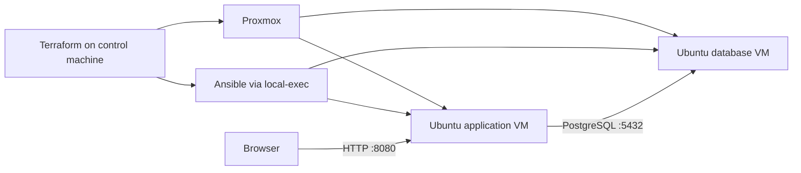

# Proxmox Infrastructure Automation with Terraform & Ansible

A lab project that provisions two Ubuntu virtual machines on Proxmox and configures a small web application backed by PostgreSQL. Terraform manages the virtual machines; Ansible installs and configures the application and database services.

The project explores infrastructure provisioning, cloud-init, configuration management, and service verification across separate application and database hosts.

**Status:** environment-specific lab implementation. Review the configuration and known limitations below before attempting deployment. The documented workflow has not been revalidated against a running Proxmox environment during this documentation update.

## Architecture



| Component | Implementation |
| --- | --- |
| Infrastructure | Terraform with `bpg/proxmox` pinned to `0.73.0` |
| VM initialization | Ubuntu Jammy cloud image, cloud-init, SSH key injection, QEMU guest agent |
| Application | Flask, SQLAlchemy, Gunicorn, and a static HTML page |
| Service management | A `flask-api.service` systemd unit |
| Database | PostgreSQL; configuration paths target version 14 |
| Configuration | Separate Ansible roles for the application and database |

The application displays names retrieved from PostgreSQL through `/api/noms`. The Ansible application role checks that this endpoint returns HTTP 200.

The role directory is named `fastApi` for historical consistency with the repository. Its implementation uses **Flask**.

## Repository structure

```text
terraform/
  main.tf                  VM modules and Ansible invocation
  outputs.tf               VM details and application URL
  app/                     Application VM configuration
  bdd/                     Database VM configuration
ansible/roles/
  main.yml                 Database role, then application role
  fastApi/                 Flask application and systemd configuration
  postgres/                PostgreSQL configuration and SQL initialization
inventory.ini              Static inventory currently used by Terraform
```

## Requirements and configuration

Use a control machine with Terraform, Ansible, the `community.postgresql` collection, and SSH access to the target environment. The Proxmox provider also uses an SSH agent.

The checked-in configuration refers to a specific lab. Adapt these settings to your environment:

| Settings | Files to review |
| --- | --- |
| VM names, addresses, memory, CPU, disk size, image reference | `terraform/main.tf` |
| Proxmox endpoint, authentication, bridge | `terraform/app/variables.tf`, `terraform/bdd/variables.tf` |
| Node, pool, datastores, gateway, SSH public-key path | Both modules' `local.tf`, `data.tf`, and `main.tf` |
| Ansible host addresses | Root `inventory.ini` |
| Database connection and application health-check URL | `ansible/roles/fastApi/vars/main.yml` |
| Database settings | `ansible/roles/postgres/vars/main.yml` |

The lab references node `mgmt`, pool `cytech`, bridge `vmbr0`, and the `raid-ssd`, `local`, and `isos` datastores. The SSH public-key path is currently `/home/cytech/.ssh/id.pub`.

Authentication and database defaults are present in the source. Replace them with your own securely supplied configuration before reuse; do not commit real credentials.

## Deployment workflow

After adapting the configuration and reviewing the limitations:

```bash
git clone https://github.com/BOupdown/terraform_ansible.git
cd terraform_ansible/terraform
terraform init
terraform validate
terraform plan
terraform apply
```

Terraform includes a `local-exec` provisioner that invokes the Ansible playbook. That playbook configures PostgreSQL first, then the application. Review the plan before approving infrastructure changes.

To obtain the application address:

```bash
terraform output -raw app_url
```

To rerun Ansible from the repository root once the VMs are reachable:

```bash
ansible-playbook -i inventory.ini ansible/roles/main.yml
```

## Verification and troubleshooting

- Open the application URL and check that names load from the database.
- Request `/api/noms` on the application host and check for HTTP 200 and a JSON response.
- For application failures, inspect `systemctl status flask-api` and `journalctl -u flask-api` on the application VM.
- For connectivity failures, check SSH access, the static inventory, PostgreSQL access rules, and the configured database address.

The API check is implemented in Ansible. These instructions do not imply a separately verified CI pipeline or a successful deployment on arbitrary Proxmox installations.

## Known limitations

- Terraform generates `terraform/inventory.yml`, but the Ansible command reads the root `inventory.ini`. Keep the static inventory aligned with the actual VM addresses.
- Both VM modules declare the same cloud-init snippet filename on the same node and datastore. Review this shared target before deployment.
- Environment values and some application/database addresses are hard-coded in multiple places.
- Proxmox TLS verification is disabled by default, and the inventory disables SSH host-key verification. These lab settings require hardening for broader use.
- Terraform resource completion does not provide an explicit wait for cloud-init and SSH readiness before Ansible starts.

## Teardown and state

From `terraform/`, review and confirm:

```bash
terraform plan -destroy
terraform destroy
```

Teardown removes managed infrastructure and can delete VM data. Preserve any data you need first.

Terraform state and downloaded providers are excluded from Git. Keep the state belonging to your own deployment in a secure location: it is needed to manage and destroy those resources. The provider lock file remains tracked for dependency reproducibility. Previously committed artifacts remain in Git history.
